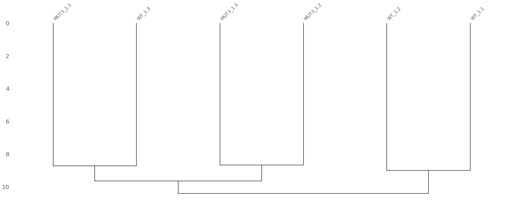
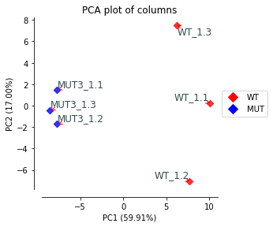

nbdev-proteomics
================

<!-- WARNING: THIS FILE WAS AUTOGENERATED! DO NOT EDIT! -->

``` python
```

    The autoreload extension is already loaded. To reload it, use:
      %reload_ext autoreload
    The rpy2.ipython extension is already loaded. To reload it, use:
      %reload_ext rpy2.ipython

A collection of utilities to process proteomics data

## Install

``` sh
pip install nbdev_proteomics
```

## How to use

Let’s start by uploading a dataset from a DIA-NN analysis

``` python
# Initialize the class with the DIA-NN output file
# a table to rename the columns and a peptide counts file
processor = DIAnnProcessor(
    "../toy_datasets/DIA-NN_output.txt",
    "../toy_datasets/DIA-NN_peptides_counts.txt",
    "../toy_datasets/DIA-NN_column_mapping.csv",
)

# Process the file and get the filtered protein quantification DataFrame
filtered_quantification = processor.process()
filtered_quantification.head()
```

    use dia-nn

    /Users/MTinti/git_projects/nbdev-proteomics/nbdev_proteomics/core.py:111: FutureWarning: The default value of regex will change from True to False in a future version.
      mapping_df['col_name'] = mapping_df['col_name'].str.replace('.IsSingleHit', '.Quantity')

<div>
<style scoped>
    .dataframe tbody tr th:only-of-type {
        vertical-align: middle;
    }

    .dataframe tbody tr th {
        vertical-align: top;
    }

    .dataframe thead th {
        text-align: right;
    }
</style>
<table border="1" class="dataframe">
  <thead>
    <tr style="text-align: right;">
      <th></th>
      <th>WT_1.1</th>
      <th>WT_1.2</th>
      <th>WT_1.3</th>
      <th>MUT3_1.1</th>
      <th>MUT3_1.2</th>
      <th>MUT3_1.3</th>
      <th>MUT4_1.1</th>
      <th>MUT4_1.2</th>
      <th>MUT4_1.3</th>
      <th>WTSOL_2.1</th>
      <th>...</th>
      <th>WTSOL_3.6</th>
      <th>WTINS_3.4</th>
      <th>WTINS_3.5</th>
      <th>WTINS_3.6</th>
      <th>MUT4SOL_3.1</th>
      <th>MUT4SOL_3.2</th>
      <th>MUT4SOL_3.3</th>
      <th>MUT4INS_3.1</th>
      <th>MUT4INS_3.2</th>
      <th>MUT4INS_3.3</th>
    </tr>
  </thead>
  <tbody>
    <tr>
      <th>GFP.BLA</th>
      <td>NaN</td>
      <td>NaN</td>
      <td>NaN</td>
      <td>9.937347e+06</td>
      <td>1.068154e+07</td>
      <td>9.845878e+06</td>
      <td>9.728128e+06</td>
      <td>1.024333e+07</td>
      <td>9.316970e+06</td>
      <td>NaN</td>
      <td>...</td>
      <td>NaN</td>
      <td>NaN</td>
      <td>NaN</td>
      <td>NaN</td>
      <td>5.944689e+06</td>
      <td>6.888683e+06</td>
      <td>6.956789e+06</td>
      <td>NaN</td>
      <td>NaN</td>
      <td>NaN</td>
    </tr>
    <tr>
      <th>Tb05.5K5.100:mRNA-p1;Tb927.5.4450:mRNA-p1</th>
      <td>3.090158e+06</td>
      <td>2.574684e+06</td>
      <td>2.751917e+06</td>
      <td>2.333518e+06</td>
      <td>2.596232e+06</td>
      <td>2.407138e+06</td>
      <td>2.508370e+06</td>
      <td>2.562637e+06</td>
      <td>2.565928e+06</td>
      <td>2.804626e+06</td>
      <td>...</td>
      <td>3.112300e+06</td>
      <td>1.033351e+06</td>
      <td>9.194551e+05</td>
      <td>1.039817e+06</td>
      <td>2.824497e+06</td>
      <td>2.757964e+06</td>
      <td>2.403540e+06</td>
      <td>1.216043e+06</td>
      <td>1.053073e+06</td>
      <td>1.048340e+06</td>
    </tr>
    <tr>
      <th>Tb05.5K5.110:mRNA-p1;Tb927.5.4460:mRNA-p1</th>
      <td>3.413114e+07</td>
      <td>3.177892e+07</td>
      <td>3.289960e+07</td>
      <td>2.989977e+07</td>
      <td>3.003979e+07</td>
      <td>3.027149e+07</td>
      <td>3.146555e+07</td>
      <td>3.074012e+07</td>
      <td>3.075175e+07</td>
      <td>3.512207e+07</td>
      <td>...</td>
      <td>3.574694e+07</td>
      <td>1.975402e+06</td>
      <td>1.821761e+06</td>
      <td>1.814954e+06</td>
      <td>3.279010e+07</td>
      <td>3.208254e+07</td>
      <td>3.190298e+07</td>
      <td>1.931748e+06</td>
      <td>1.978563e+06</td>
      <td>1.991076e+06</td>
    </tr>
    <tr>
      <th>Tb05.5K5.120:mRNA-p1;Tb927.5.4470:mRNA-p1</th>
      <td>4.962111e+06</td>
      <td>5.049931e+06</td>
      <td>4.865019e+06</td>
      <td>4.767877e+06</td>
      <td>4.826146e+06</td>
      <td>4.738838e+06</td>
      <td>4.982286e+06</td>
      <td>4.989706e+06</td>
      <td>4.672616e+06</td>
      <td>6.168714e+05</td>
      <td>...</td>
      <td>1.333413e+06</td>
      <td>8.680057e+06</td>
      <td>8.580248e+06</td>
      <td>8.776530e+06</td>
      <td>1.135220e+06</td>
      <td>9.074091e+05</td>
      <td>9.992258e+05</td>
      <td>8.560026e+06</td>
      <td>8.473488e+06</td>
      <td>8.810763e+06</td>
    </tr>
    <tr>
      <th>Tb05.5K5.130:mRNA-p1;Tb927.5.4480:mRNA-p1</th>
      <td>3.773686e+07</td>
      <td>3.370411e+07</td>
      <td>2.815374e+07</td>
      <td>2.328151e+07</td>
      <td>2.889554e+07</td>
      <td>3.085169e+07</td>
      <td>3.111706e+07</td>
      <td>3.134872e+07</td>
      <td>2.640844e+07</td>
      <td>4.603374e+06</td>
      <td>...</td>
      <td>8.123416e+06</td>
      <td>8.085395e+07</td>
      <td>8.397210e+07</td>
      <td>8.286466e+07</td>
      <td>6.640407e+06</td>
      <td>7.224879e+06</td>
      <td>7.921410e+06</td>
      <td>8.585187e+07</td>
      <td>8.267973e+07</td>
      <td>8.537414e+07</td>
    </tr>
  </tbody>
</table>
<p>5 rows × 33 columns</p>
</div>

## exctract a subset of the dataframe

``` python
df = filtered_quantification.iloc[:,:6]
print(df.shape)
df = df.dropna(how='all',axis=1)
print(df.shape)
df.head()
```

    (6243, 6)
    (6243, 6)

<div>
<style scoped>
    .dataframe tbody tr th:only-of-type {
        vertical-align: middle;
    }

    .dataframe tbody tr th {
        vertical-align: top;
    }

    .dataframe thead th {
        text-align: right;
    }
</style>
<table border="1" class="dataframe">
  <thead>
    <tr style="text-align: right;">
      <th></th>
      <th>WT_1.1</th>
      <th>WT_1.2</th>
      <th>WT_1.3</th>
      <th>MUT3_1.1</th>
      <th>MUT3_1.2</th>
      <th>MUT3_1.3</th>
    </tr>
  </thead>
  <tbody>
    <tr>
      <th>GFP.BLA</th>
      <td>NaN</td>
      <td>NaN</td>
      <td>NaN</td>
      <td>9.937347e+06</td>
      <td>1.068154e+07</td>
      <td>9.845878e+06</td>
    </tr>
    <tr>
      <th>Tb05.5K5.100:mRNA-p1;Tb927.5.4450:mRNA-p1</th>
      <td>3.090158e+06</td>
      <td>2.574684e+06</td>
      <td>2.751917e+06</td>
      <td>2.333518e+06</td>
      <td>2.596232e+06</td>
      <td>2.407138e+06</td>
    </tr>
    <tr>
      <th>Tb05.5K5.110:mRNA-p1;Tb927.5.4460:mRNA-p1</th>
      <td>3.413114e+07</td>
      <td>3.177892e+07</td>
      <td>3.289960e+07</td>
      <td>2.989977e+07</td>
      <td>3.003979e+07</td>
      <td>3.027149e+07</td>
    </tr>
    <tr>
      <th>Tb05.5K5.120:mRNA-p1;Tb927.5.4470:mRNA-p1</th>
      <td>4.962111e+06</td>
      <td>5.049931e+06</td>
      <td>4.865019e+06</td>
      <td>4.767877e+06</td>
      <td>4.826146e+06</td>
      <td>4.738838e+06</td>
    </tr>
    <tr>
      <th>Tb05.5K5.130:mRNA-p1;Tb927.5.4480:mRNA-p1</th>
      <td>3.773686e+07</td>
      <td>3.370411e+07</td>
      <td>2.815374e+07</td>
      <td>2.328151e+07</td>
      <td>2.889554e+07</td>
      <td>3.085169e+07</td>
    </tr>
  </tbody>
</table>
</div>

``` python
df.describe()
```

<div>
<style scoped>
    .dataframe tbody tr th:only-of-type {
        vertical-align: middle;
    }

    .dataframe tbody tr th {
        vertical-align: top;
    }

    .dataframe thead th {
        text-align: right;
    }
</style>
<table border="1" class="dataframe">
  <thead>
    <tr style="text-align: right;">
      <th></th>
      <th>WT_1.1</th>
      <th>WT_1.2</th>
      <th>WT_1.3</th>
      <th>MUT3_1.1</th>
      <th>MUT3_1.2</th>
      <th>MUT3_1.3</th>
    </tr>
  </thead>
  <tbody>
    <tr>
      <th>count</th>
      <td>6.121000e+03</td>
      <td>6.100000e+03</td>
      <td>6.103000e+03</td>
      <td>6.093000e+03</td>
      <td>6.107000e+03</td>
      <td>6.116000e+03</td>
    </tr>
    <tr>
      <th>mean</th>
      <td>3.599249e+07</td>
      <td>3.543187e+07</td>
      <td>3.535706e+07</td>
      <td>3.248318e+07</td>
      <td>3.240360e+07</td>
      <td>3.263686e+07</td>
    </tr>
    <tr>
      <th>std</th>
      <td>3.026840e+08</td>
      <td>2.929701e+08</td>
      <td>3.003849e+08</td>
      <td>2.607200e+08</td>
      <td>2.501787e+08</td>
      <td>2.565394e+08</td>
    </tr>
    <tr>
      <th>min</th>
      <td>3.204720e+04</td>
      <td>6.152255e+04</td>
      <td>3.883329e+04</td>
      <td>6.272731e+04</td>
      <td>9.318066e+04</td>
      <td>8.053832e+04</td>
    </tr>
    <tr>
      <th>25%</th>
      <td>2.071758e+06</td>
      <td>2.104831e+06</td>
      <td>2.123954e+06</td>
      <td>2.055398e+06</td>
      <td>2.105090e+06</td>
      <td>2.034196e+06</td>
    </tr>
    <tr>
      <th>50%</th>
      <td>4.921638e+06</td>
      <td>4.928115e+06</td>
      <td>4.907622e+06</td>
      <td>4.794456e+06</td>
      <td>4.868387e+06</td>
      <td>4.816218e+06</td>
    </tr>
    <tr>
      <th>75%</th>
      <td>1.327099e+07</td>
      <td>1.310617e+07</td>
      <td>1.300904e+07</td>
      <td>1.269331e+07</td>
      <td>1.262831e+07</td>
      <td>1.285196e+07</td>
    </tr>
    <tr>
      <th>max</th>
      <td>1.643516e+10</td>
      <td>1.617111e+10</td>
      <td>1.550483e+10</td>
      <td>1.319888e+10</td>
      <td>1.241172e+10</td>
      <td>1.318592e+10</td>
    </tr>
  </tbody>
</table>
</div>

``` python
dataset_viz = DatasetViz(df = df, palette = ['r']*3+['b']*3)
dataset_viz.analyse_missing_values(figsize=(8,4))
dataset_viz.analyse_values_distribution(figsize=(8,4))
```


    /Users/MTinti/git_projects/nbdev-proteomics/nbdev_proteomics/core.py:47: UserWarning: This figure includes Axes that are not compatible with tight_layout, so results might be incorrect.
      plt.tight_layout()





``` python
df_norm_load = norm_loading(df)
dataset_viz = DatasetViz(df = df_norm_load, palette = ['r']*3+['b']*3)
dataset_viz.analyse_missing_values(figsize=(8,4))
dataset_viz.analyse_values_distribution(figsize=(8,4))
```

    WT_1.1      4.921638e+06
    WT_1.2      4.928115e+06
    WT_1.3      4.907622e+06
    MUT3_1.1    4.794456e+06
    MUT3_1.2    4.868387e+06
    MUT3_1.3    4.816218e+06
    dtype: float64
    4872739.30693322
    WT_1.1      0.990065
    WT_1.2      0.988763
    WT_1.3      0.992892
    MUT3_1.1    1.016328
    MUT3_1.2    1.000894
    MUT3_1.3    1.011736
    dtype: float64


    /Users/MTinti/git_projects/nbdev-proteomics/nbdev_proteomics/core.py:47: UserWarning: This figure includes Axes that are not compatible with tight_layout, so results might be incorrect.
      plt.tight_layout()


``` python
df_norm_load.describe()
```

<div>
<style scoped>
    .dataframe tbody tr th:only-of-type {
        vertical-align: middle;
    }

    .dataframe tbody tr th {
        vertical-align: top;
    }

    .dataframe thead th {
        text-align: right;
    }
</style>
<table border="1" class="dataframe">
  <thead>
    <tr style="text-align: right;">
      <th></th>
      <th>WT_1.1</th>
      <th>WT_1.2</th>
      <th>WT_1.3</th>
      <th>MUT3_1.1</th>
      <th>MUT3_1.2</th>
      <th>MUT3_1.3</th>
    </tr>
  </thead>
  <tbody>
    <tr>
      <th>count</th>
      <td>6.121000e+03</td>
      <td>6.100000e+03</td>
      <td>6.103000e+03</td>
      <td>6.093000e+03</td>
      <td>6.107000e+03</td>
      <td>6.116000e+03</td>
    </tr>
    <tr>
      <th>mean</th>
      <td>3.563489e+07</td>
      <td>3.503373e+07</td>
      <td>3.510575e+07</td>
      <td>3.301356e+07</td>
      <td>3.243256e+07</td>
      <td>3.301988e+07</td>
    </tr>
    <tr>
      <th>std</th>
      <td>2.996768e+08</td>
      <td>2.896781e+08</td>
      <td>2.982498e+08</td>
      <td>2.649770e+08</td>
      <td>2.504023e+08</td>
      <td>2.595501e+08</td>
    </tr>
    <tr>
      <th>min</th>
      <td>3.172880e+04</td>
      <td>6.083124e+04</td>
      <td>3.855726e+04</td>
      <td>6.375152e+04</td>
      <td>9.326396e+04</td>
      <td>8.148349e+04</td>
    </tr>
    <tr>
      <th>25%</th>
      <td>2.051175e+06</td>
      <td>2.081180e+06</td>
      <td>2.108857e+06</td>
      <td>2.088959e+06</td>
      <td>2.106972e+06</td>
      <td>2.058069e+06</td>
    </tr>
    <tr>
      <th>50%</th>
      <td>4.872739e+06</td>
      <td>4.872739e+06</td>
      <td>4.872739e+06</td>
      <td>4.872739e+06</td>
      <td>4.872739e+06</td>
      <td>4.872739e+06</td>
    </tr>
    <tr>
      <th>75%</th>
      <td>1.313913e+07</td>
      <td>1.295890e+07</td>
      <td>1.291657e+07</td>
      <td>1.290056e+07</td>
      <td>1.263960e+07</td>
      <td>1.300279e+07</td>
    </tr>
    <tr>
      <th>max</th>
      <td>1.627187e+10</td>
      <td>1.598940e+10</td>
      <td>1.539462e+10</td>
      <td>1.341439e+10</td>
      <td>1.242281e+10</td>
      <td>1.334066e+10</td>
    </tr>
  </tbody>
</table>
</div>

``` python
df_norm_load_imputed = impute_proteomics_data(df_norm_load, ['A','A','A','B','B','B'])
dataset_viz = DatasetViz(df = df_norm_load_imputed,palette = ['r']*3+['b']*3)
dataset_viz.analyse_missing_values(figsize=(8,4))
dataset_viz.analyse_values_distribution(figsize=(8,4))
```

    detection_limit 116342.31145379972
    detection_limit 128099.10559899165


    /Users/MTinti/git_projects/nbdev-proteomics/nbdev_proteomics/core.py:47: UserWarning: This figure includes Axes that are not compatible with tight_layout, so results might be incorrect.
      plt.tight_layout()


    /Users/MTinti/miniconda3/envs/work3/lib/python3.10/site-packages/scipy/cluster/hierarchy.py:2848: UserWarning: Attempting to set identical bottom == top == 0.0 results in singular transformations; automatically expanding.
      ax.set_ylim([dvw, 0])


``` python
df_norm_load_imputed.describe()
```

<div>
<style scoped>
    .dataframe tbody tr th:only-of-type {
        vertical-align: middle;
    }

    .dataframe tbody tr th {
        vertical-align: top;
    }

    .dataframe thead th {
        text-align: right;
    }
</style>
<table border="1" class="dataframe">
  <thead>
    <tr style="text-align: right;">
      <th></th>
      <th>WT_1.1</th>
      <th>WT_1.2</th>
      <th>WT_1.3</th>
      <th>MUT3_1.1</th>
      <th>MUT3_1.2</th>
      <th>MUT3_1.3</th>
    </tr>
  </thead>
  <tbody>
    <tr>
      <th>count</th>
      <td>6.243000e+03</td>
      <td>6.243000e+03</td>
      <td>6.243000e+03</td>
      <td>6.243000e+03</td>
      <td>6.243000e+03</td>
      <td>6.243000e+03</td>
    </tr>
    <tr>
      <th>mean</th>
      <td>3.500388e+07</td>
      <td>3.428569e+07</td>
      <td>3.435546e+07</td>
      <td>3.223570e+07</td>
      <td>3.174941e+07</td>
      <td>3.236600e+07</td>
    </tr>
    <tr>
      <th>std</th>
      <td>2.967683e+08</td>
      <td>2.863835e+08</td>
      <td>2.949284e+08</td>
      <td>2.618208e+08</td>
      <td>2.477018e+08</td>
      <td>2.569362e+08</td>
    </tr>
    <tr>
      <th>min</th>
      <td>6.270057e+04</td>
      <td>3.573866e+04</td>
      <td>6.979540e+04</td>
      <td>4.971745e+04</td>
      <td>7.005435e+04</td>
      <td>7.510013e+04</td>
    </tr>
    <tr>
      <th>25%</th>
      <td>1.973416e+06</td>
      <td>1.957926e+06</td>
      <td>1.994725e+06</td>
      <td>1.993400e+06</td>
      <td>2.034857e+06</td>
      <td>1.977900e+06</td>
    </tr>
    <tr>
      <th>50%</th>
      <td>4.810964e+06</td>
      <td>4.729558e+06</td>
      <td>4.746362e+06</td>
      <td>4.700474e+06</td>
      <td>4.700683e+06</td>
      <td>4.711367e+06</td>
    </tr>
    <tr>
      <th>75%</th>
      <td>1.285453e+07</td>
      <td>1.278215e+07</td>
      <td>1.271491e+07</td>
      <td>1.244475e+07</td>
      <td>1.227793e+07</td>
      <td>1.252151e+07</td>
    </tr>
    <tr>
      <th>max</th>
      <td>1.627187e+10</td>
      <td>1.598940e+10</td>
      <td>1.539462e+10</td>
      <td>1.341439e+10</td>
      <td>1.242281e+10</td>
      <td>1.334066e+10</td>
    </tr>
  </tbody>
</table>
</div>

``` python
imputed_selection_normed = np.log2(df_norm_load_imputed)
```

``` python
colors = ['r']*3+['b']*3
color_to_label = {'r': 'WT', 'b': 'MUT'}
plot_mds_columns(imputed_selection_normed, colors, color_to_label)
```



``` python
plot_pca_columns(imputed_selection_normed, colors, color_to_label)
```


``` python
imputed_selection_normed.describe()
```

<div>
<style scoped>
    .dataframe tbody tr th:only-of-type {
        vertical-align: middle;
    }

    .dataframe tbody tr th {
        vertical-align: top;
    }

    .dataframe thead th {
        text-align: right;
    }
</style>
<table border="1" class="dataframe">
  <thead>
    <tr style="text-align: right;">
      <th></th>
      <th>WT_1.1</th>
      <th>WT_1.2</th>
      <th>WT_1.3</th>
      <th>MUT3_1.1</th>
      <th>MUT3_1.2</th>
      <th>MUT3_1.3</th>
    </tr>
  </thead>
  <tbody>
    <tr>
      <th>count</th>
      <td>6243.000000</td>
      <td>6243.000000</td>
      <td>6243.000000</td>
      <td>6243.000000</td>
      <td>6243.000000</td>
      <td>6243.000000</td>
    </tr>
    <tr>
      <th>mean</th>
      <td>22.403845</td>
      <td>22.381052</td>
      <td>22.378178</td>
      <td>22.360137</td>
      <td>22.384886</td>
      <td>22.369707</td>
    </tr>
    <tr>
      <th>std</th>
      <td>2.261069</td>
      <td>2.255893</td>
      <td>2.246310</td>
      <td>2.248442</td>
      <td>2.203476</td>
      <td>2.245750</td>
    </tr>
    <tr>
      <th>min</th>
      <td>15.936191</td>
      <td>15.125198</td>
      <td>16.090844</td>
      <td>15.601465</td>
      <td>16.096187</td>
      <td>16.196528</td>
    </tr>
    <tr>
      <th>25%</th>
      <td>20.912263</td>
      <td>20.900894</td>
      <td>20.927758</td>
      <td>20.926800</td>
      <td>20.956496</td>
      <td>20.915538</td>
    </tr>
    <tr>
      <th>50%</th>
      <td>22.197895</td>
      <td>22.173274</td>
      <td>22.178391</td>
      <td>22.164375</td>
      <td>22.164439</td>
      <td>22.167714</td>
    </tr>
    <tr>
      <th>75%</th>
      <td>23.615773</td>
      <td>23.607625</td>
      <td>23.600017</td>
      <td>23.569034</td>
      <td>23.549561</td>
      <td>23.577906</td>
    </tr>
    <tr>
      <th>max</th>
      <td>33.921661</td>
      <td>33.896397</td>
      <td>33.841707</td>
      <td>33.643062</td>
      <td>33.532273</td>
      <td>33.635111</td>
    </tr>
  </tbody>
</table>
</div>

``` python
imputed_selection_normed.head()
```

<div>
<style scoped>
    .dataframe tbody tr th:only-of-type {
        vertical-align: middle;
    }

    .dataframe tbody tr th {
        vertical-align: top;
    }

    .dataframe thead th {
        text-align: right;
    }
</style>
<table border="1" class="dataframe">
  <thead>
    <tr style="text-align: right;">
      <th></th>
      <th>WT_1.1</th>
      <th>WT_1.2</th>
      <th>WT_1.3</th>
      <th>MUT3_1.1</th>
      <th>MUT3_1.2</th>
      <th>MUT3_1.3</th>
    </tr>
  </thead>
  <tbody>
    <tr>
      <th>GFP.BLA</th>
      <td>16.898126</td>
      <td>16.934329</td>
      <td>16.905109</td>
      <td>23.267795</td>
      <td>23.349905</td>
      <td>23.247921</td>
    </tr>
    <tr>
      <th>Tb05.5K5.100:mRNA-p1;Tb927.5.4450:mRNA-p1</th>
      <td>21.544844</td>
      <td>21.279661</td>
      <td>21.381715</td>
      <td>21.177441</td>
      <td>21.309277</td>
      <td>21.215720</td>
    </tr>
    <tr>
      <th>Tb05.5K5.110:mRNA-p1;Tb927.5.4460:mRNA-p1</th>
      <td>25.010180</td>
      <td>24.905264</td>
      <td>24.961276</td>
      <td>24.856997</td>
      <td>24.841660</td>
      <td>24.868289</td>
    </tr>
    <tr>
      <th>Tb05.5K5.120:mRNA-p1;Tb927.5.4470:mRNA-p1</th>
      <td>22.228117</td>
      <td>22.251529</td>
      <td>22.203723</td>
      <td>22.208281</td>
      <td>22.203729</td>
      <td>22.192934</td>
    </tr>
    <tr>
      <th>Tb05.5K5.130:mRNA-p1;Tb927.5.4480:mRNA-p1</th>
      <td>25.155066</td>
      <td>24.990118</td>
      <td>24.736532</td>
      <td>24.496047</td>
      <td>24.785633</td>
      <td>24.895679</td>
    </tr>
  </tbody>
</table>
</div>

``` python
library("limma")

limma_differential_expression <- function(df, replicates_A, replicates_B) {
  # Define sample groups
  sample_groups <- factor(
    c(rep("A", replicates_A), rep("B", replicates_B)),
    levels = c("A", "B")
  )

  # Create a design matrix
  design_matrix <- model.matrix(~0 + sample_groups)
  colnames(design_matrix) <- c("A", "B")

  # Fit a linear model to the data
  lm_fit <- lmFit(df, design_matrix)

  # Define contrasts (comparisons between groups)
  contrast_matrix <- makeContrasts("B-A", levels = design_matrix)

  # Fit the contrasts to the linear model
  contrasted_fit <- contrasts.fit(lm_fit, contrast_matrix)

  # Apply empirical Bayes smoothing
  ebayes_fit <- eBayes(contrasted_fit)

  # Extract results without sorting and return all rows
  results <- topTable(ebayes_fit, coef = 1, sort.by = "none", number = Inf)

  return(results)
}
```

``` python
results <- limma_differential_expression(imputed_selection_normed, 3, 3)
head(results)
```

                                                    logFC  AveExpr           t
    GFP.BLA                                    6.37601898 20.10053 141.6807612
    Tb05.5K5.100:mRNA-p1;Tb927.5.4450:mRNA-p1 -0.16792710 21.31811  -2.1042531
    Tb05.5K5.110:mRNA-p1;Tb927.5.4460:mRNA-p1 -0.10325758 24.90728  -2.3416622
    Tb05.5K5.120:mRNA-p1;Tb927.5.4470:mRNA-p1 -0.02614141 22.21472  -0.6927785
    Tb05.5K5.130:mRNA-p1;Tb927.5.4480:mRNA-p1 -0.23478582 24.84318  -1.6211096
    Tb05.5K5.150:mRNA-p1;Tb927.5.4500:mRNA-p1 -0.05630553 26.25538  -0.7966753
                                                   P.Value    adj.P.Val         B
    GFP.BLA                                   1.227367e-11 7.662453e-08 11.975338
    Tb05.5K5.100:mRNA-p1;Tb927.5.4450:mRNA-p1 8.083969e-02 2.254758e-01 -5.533761
    Tb05.5K5.110:mRNA-p1;Tb927.5.4460:mRNA-p1 5.847526e-02 1.861607e-01 -5.200172
    Tb05.5K5.120:mRNA-p1;Tb927.5.4470:mRNA-p1 5.148037e-01 6.803489e-01 -7.187835
    Tb05.5K5.130:mRNA-p1;Tb927.5.4480:mRNA-p1 1.570105e-01 3.307074e-01 -6.190819
    Tb05.5K5.150:mRNA-p1;Tb927.5.4500:mRNA-p1 4.565225e-01 6.361313e-01 -7.105443

``` python
results
```

<div>
<style scoped>
    .dataframe tbody tr th:only-of-type {
        vertical-align: middle;
    }

    .dataframe tbody tr th {
        vertical-align: top;
    }

    .dataframe thead th {
        text-align: right;
    }
</style>
<table border="1" class="dataframe">
  <thead>
    <tr style="text-align: right;">
      <th></th>
      <th>logFC</th>
      <th>AveExpr</th>
      <th>t</th>
      <th>P.Value</th>
      <th>adj.P.Val</th>
      <th>B</th>
    </tr>
  </thead>
  <tbody>
    <tr>
      <th>GFP.BLA</th>
      <td>6.376019</td>
      <td>20.100531</td>
      <td>141.680761</td>
      <td>1.227367e-11</td>
      <td>7.662453e-08</td>
      <td>11.975338</td>
    </tr>
    <tr>
      <th>Tb05.5K5.100:mRNA-p1;Tb927.5.4450:mRNA-p1</th>
      <td>-0.167927</td>
      <td>21.318110</td>
      <td>-2.104253</td>
      <td>8.083969e-02</td>
      <td>2.254758e-01</td>
      <td>-5.533761</td>
    </tr>
    <tr>
      <th>Tb05.5K5.110:mRNA-p1;Tb927.5.4460:mRNA-p1</th>
      <td>-0.103258</td>
      <td>24.907278</td>
      <td>-2.341662</td>
      <td>5.847526e-02</td>
      <td>1.861607e-01</td>
      <td>-5.200172</td>
    </tr>
    <tr>
      <th>Tb05.5K5.120:mRNA-p1;Tb927.5.4470:mRNA-p1</th>
      <td>-0.026141</td>
      <td>22.214719</td>
      <td>-0.692778</td>
      <td>5.148037e-01</td>
      <td>6.803489e-01</td>
      <td>-7.187835</td>
    </tr>
    <tr>
      <th>Tb05.5K5.130:mRNA-p1;Tb927.5.4480:mRNA-p1</th>
      <td>-0.234786</td>
      <td>24.843179</td>
      <td>-1.621110</td>
      <td>1.570105e-01</td>
      <td>3.307074e-01</td>
      <td>-6.190819</td>
    </tr>
    <tr>
      <th>...</th>
      <td>...</td>
      <td>...</td>
      <td>...</td>
      <td>...</td>
      <td>...</td>
      <td>...</td>
    </tr>
    <tr>
      <th>Tb927.9.9870:mRNA-p1</th>
      <td>0.021158</td>
      <td>23.977410</td>
      <td>0.505379</td>
      <td>6.316299e-01</td>
      <td>7.658313e-01</td>
      <td>-7.311024</td>
    </tr>
    <tr>
      <th>Tb927.9.9940:mRNA-p1</th>
      <td>0.110974</td>
      <td>26.507374</td>
      <td>2.626926</td>
      <td>3.988324e-02</td>
      <td>1.549416e-01</td>
      <td>-4.798176</td>
    </tr>
    <tr>
      <th>Tb927.9.9950:mRNA-p1</th>
      <td>0.086074</td>
      <td>19.670132</td>
      <td>0.733765</td>
      <td>4.912372e-01</td>
      <td>6.630906e-01</td>
      <td>-7.156471</td>
    </tr>
    <tr>
      <th>Tb927.9.9960:mRNA-p1</th>
      <td>-0.265460</td>
      <td>21.796494</td>
      <td>-6.334561</td>
      <td>7.763973e-04</td>
      <td>2.297179e-02</td>
      <td>-0.448621</td>
    </tr>
    <tr>
      <th>Tb927.9.9970:mRNA-p1</th>
      <td>-0.037307</td>
      <td>21.473382</td>
      <td>-0.671714</td>
      <td>5.272019e-01</td>
      <td>6.897781e-01</td>
      <td>-7.203359</td>
    </tr>
  </tbody>
</table>
<p>6243 rows × 6 columns</p>
</div>

``` python
import matplotlib.pyplot as plt
import numpy as np

def plot_volcano_ma(df, title, protein_indices=None, protein_ids=None, protein_colors=None):
    if protein_indices is None:
        protein_indices = []

    if protein_ids is None:
        protein_ids = []

    if protein_colors is None:
        protein_colors = ['r'] * len(protein_indices)

    df['log10pval'] = -np.log10(df['P.Value'])
    df['log10adjpval'] = -np.log10(df['adj.P.Val'])

    fig, axes = plt.subplots(figsize=(14, 4), ncols=2, nrows=1)

    # Volcano plot
    ax = axes[0]
    df.plot(x='logFC', y='log10adjpval', kind='scatter', s=5, alpha=0.1, ax=ax, c='black')

    # Add lines
    pval_threshold = -np.log10(0.05)
    ax.axhline(y=pval_threshold, color='r', linestyle='--')
    ax.axvline(x=-1, color='g', linestyle='--')
    ax.axvline(x=1, color='g', linestyle='--')

    for index, protein_id, color in zip(protein_indices, protein_ids, protein_colors):
        df.loc[[index]].plot(x='logFC', y='log10adjpval', kind='scatter', s=20, alpha=1, ax=ax, c=color)
        ax.text(df.loc[index]['logFC'], df.loc[index]['log10adjpval'], protein_id, c=color)

    ax.set_title('Volcano')

    # MA plot
    ax = axes[1]
    df.plot(x='AveExpr', y='logFC', kind='scatter', s=5, alpha=0.1, ax=ax, c='black')

    for index, protein_id, color in zip(protein_indices, protein_ids, protein_colors):
        df.loc[[index]].plot(x='AveExpr', y='logFC', kind='scatter', s=20, alpha=1, ax=ax, c=color)
        ax.text(df.loc[index]['AveExpr'], df.loc[index]['logFC'], protein_id, c=color, fontsize=10)

    ax.legend(loc='center left', bbox_to_anchor=(1, 0.5))
    ax.set_title('MA')
    plt.suptitle(title)
    plt.show()

    df['P.Value'].plot(kind='hist', bins=100)
    plt.show()


# Usage example:
plot_volcano_ma(results, "comparison WT 113", 
                protein_indices=['GFP.BLA','Tb427.BES40.22'], 
                protein_ids=['BLA','BES'], protein_colors=['b','r'])
```

    No artists with labels found to put in legend.  Note that artists whose label start with an underscore are ignored when legend() is called with no argument.


